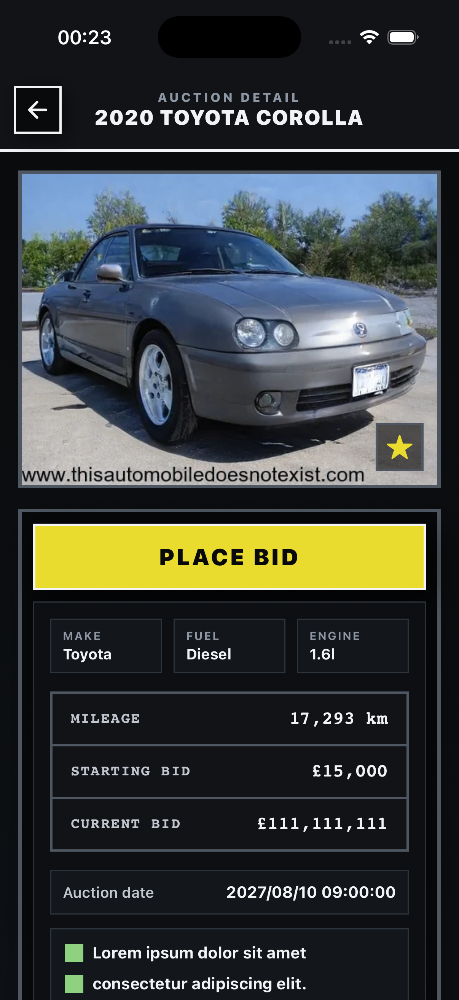
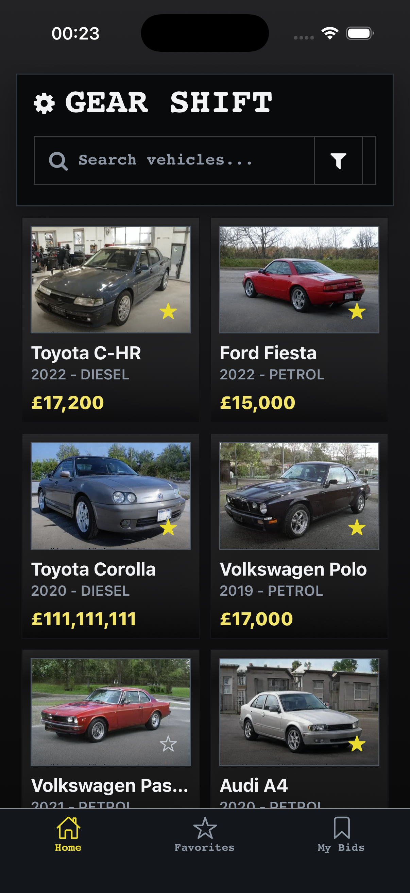
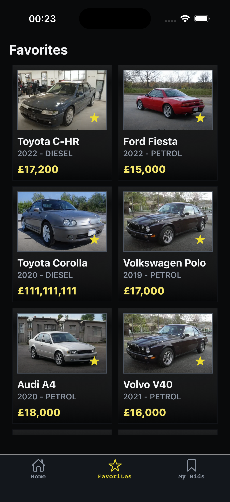
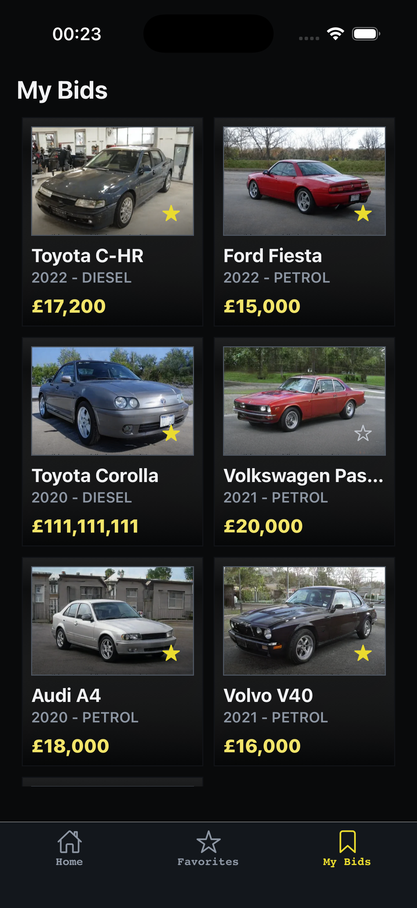

# React Native Vehicle Catalog Workspace

Basic pnpm workspace with:

- `frontend`: Expo React Native app
- `backend`: `json-server` API

## Screenshots

<p align="center">
  
  
  
  
</p>

## Prerequisites

- Node.js (v18+ recommended)
- pnpm: `npm install -g pnpm`
- Expo Go app (for physical device testing)
- iOS: macOS + Xcode
- Android: Android Studio + SDK

## Configuration

1. Install dependencies (from root directory):
   ```bash
   pnpm install
   ```
2. Create a `.env` file in the frontend directory:
   ```bash
   cp frontend/.env.example frontend/.env
   ```
3. Update `EXPO_PUBLIC_API_BASE_URL` in `frontend/.env`:
   ```bash
   EXPO_PUBLIC_API_BASE_URL=http://localhost:3001
   ```

### Physical Device / Android Emulator

Use your machine's IP address instead of `localhost`:

- macOS: `ipconfig getifaddr en0`
- Linux: `hostname -I`
- Windows: `ipconfig`
- Android emulator: `10.0.2.2`

## Run

Start both services in separate terminals:

```bash
pnpm run dev:backend
# and on another terminal
pnpm run dev:frontend
```

Select platform by pressing:

- Android: `a`
- iOS: `i`
- Web: `w`

## Project Structure

- `frontend/` - Expo React Native app
- `backend/` - json-server API with `db.json`
- `shared/` - Shared types and utilities

## Troubleshooting

**Port 3001 occupied?**
Change port in `backend/package.json` and update `EXPO_PUBLIC_API_BASE_URL`.

**Frontend can't connect to backend?**

- Check if backend is running
- Verify `EXPO_PUBLIC_API_BASE_URL` matches backend URL
- For physical devices, use your machine's IP address

**Metro bundler issues?**
Clear cache: `pnpm --filter frontend start -c`

## Quality

```bash
pnpm run lint
pnpm run lint:fix
pnpm run format:check
pnpm run format
```
